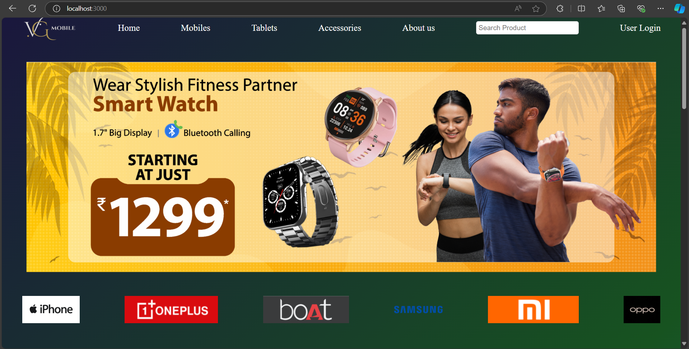

# VG Mobile

VG Mobile is a fully functional e-commerce platform built to showcase a range of mobile phones, tablets, and smart TVs. This project was developed as a personal endeavor to strengthen full-stack development skills and integrate modern web technologies such as Node.js, Express.js, MongoDB, HTML, and CSS.

## Table of Contents
- [Features](#features)
- [Technologies Used](#technologies-used)
- [Installation](#installation)
- [Usage](#usage)
- [Project Structure](#project-structure)
- [Future Enhancements](#future-enhancements)
- [Screenshots](#screenshots)
- [License](#license)

## Features
- JWT Authentication: Secure login and user authentication using JWT tokens.
- Product Management: Users can view, manage, and update a wide variety of products (mobiles, tablets, and smart TVs).
- MongoDB Integration: Efficient database management for storing user details, product listings, and transactions.
- Cart Functionality: Users can add items to their cart and proceed to checkout.
- Custom Forms: Intuitive forms for easy data entry and updates.

## Technologies Used
- Backend:
  - Node.js
  - Express.js
  - MongoDB
  - JWT (JSON Web Tokens) for secure authentication
- Frontend:
  - HTML5
  - CSS3
- Other Tools:
  - Mongoose (MongoDB object modeling)
  - Postman (for API testing)

## Installation

1. Clone the repository:
   ```bash
   git clone https://github.com/yourusername/vg-mobile.git
   ```

2. Install dependencies:
   Navigate to the project root directory and install backend dependencies:
   ```bash
   cd vg-mobile
   npm install
   ```

3. Set up MongoDB:
   Make sure you have MongoDB installed locally or use MongoDB Atlas. Update your MongoDB connection string in the `.env` file.

4. Run the server:
   Start the server using:
   ```bash
   npm run server
   ```

5. Open `http://localhost:3000` in your browser to view the app.

## Usage

- Signup/Login: New users can create an account or log in using their credentials.
- Product View: Users can browse and search for mobile phones, tablets, and smart TVs.
- Cart: Users can add products to their cart and proceed to checkout.
- Admin Management: Admins can add, update, or delete products via custom forms.

## Project Structure

```
vg-mobile/
├── models/               # MongoDB schemas (User, Product, Cart, etc.)
├── routes/               # API routes for authentication, products, cart, etc.
├── controllers/          # Logic for handling API requests
├── config/               # Configuration files (MongoDB connection, JWT, etc.)
├── public/               # Static assets
└── server.js             # Main entry point for the Node.js server
```

## Future Enhancements
- Payment Integration: Add payment gateway support for real-world transactions.
- Enhanced Security: Implement OAuth or other security enhancements.
- Product Reviews: Enable users to leave reviews and ratings for products.
- Order Tracking: Add a feature for users to track their orders.
- Wishlist: Implement wishlist functionality to save favorite products.

## Screenshots




## License

This project is licensed under the MIT License - see the [LICENSE](LICENSE) file for details.
